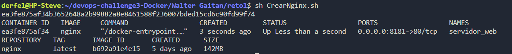
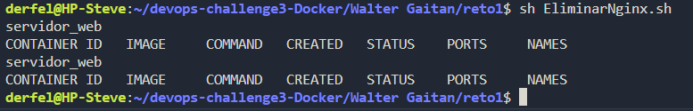

# Reto 1

1. Armar un script en Bash con todos los pasos para crear el contenedor

Para esto se utiliza el comando docker run -d --name servidor_web -p 8181:80 nginx contenido en el script CrearContenedor.sh

El resultado es el siguiente:

Luego, si se desea eliminar el contenedor se utiliza el comando docker rm servidor_web y el resultado es el siguiente:
