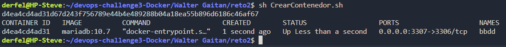

# Reto 2

1. Arrancar un contenedor que se llame `bbdd` y que ejecute una instancia de la imagen **mariadb** para que sea accesible desde el puerto 3306. Establecer variables de entorno.

Para realizar esto usaremos el script CrearContenedor.sh que se encuentra en la carpeta de la solución. El cual llama a la imagen mariadb y crea un contenedor con el nombre bbdd.

**Debido a que el puerto 3306 ya estaba en uso, decidi utilizar el puerto 3307**

Se muestra el contenedor corriendo en la siguiente imagen:

2. Mostrar una conexión al servidor de base de datos con el usuario creado y de la base de datos `prueba` creada automáticamente.

3. Pantallazo donde se comprueba que no se puede borrar la imagen `mariadb` mientras el contenedor `bbdd` está creado.
