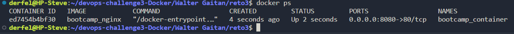
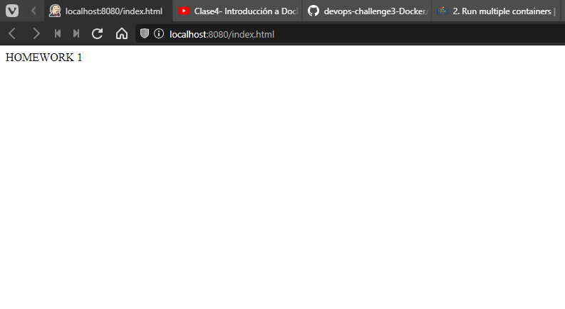
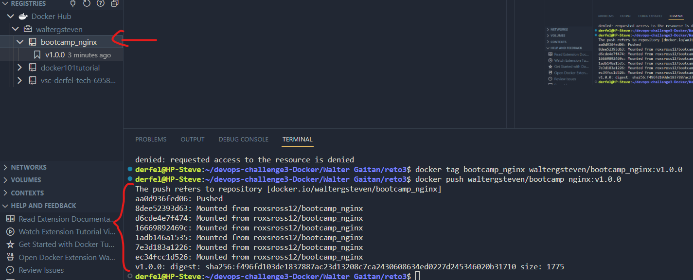

# Reto 3

## Crear un contenedor con las siguientes especificaciones:
    a. Utilizar la imagen base NGINX haciendo uso de la version nginx:alpine
    b. Al acceder a la URL localhost:8080/index.html aparecer el mensaje HOMEWORK 1
    c. Persistir el fichero index.html en un volumen llamado static_content

1. Crear el archivo Dockerfile
2. Correr script CrearContenedor.sh, este hara lo siguiente:
    - Crear el volumen static_content
    - Crear la imagen bootcamp_nginx
    - Crear el contenedor bootcamp_container
    - Correr el contenedor

Muestra de docker ps -a

3. Acceder a la URL http://localhost:8080/index.html y comprobar que aparece la pagina deseada

4. Subir el contenedor a dockerhub. Para ello se debe de logear en docker-hub desde la terminal, luego crear un tag con el nombre de la imagen y pushearla al registry.

Se deberia mostrar que el contenedor se ha subido correctamente como aparece en la terminal. Y se ha subido en dockerhub, como se muestra en la parte izquierda de la imagen.

