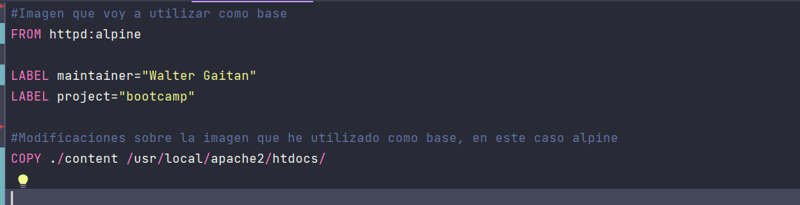
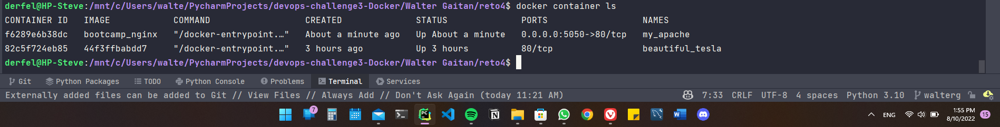
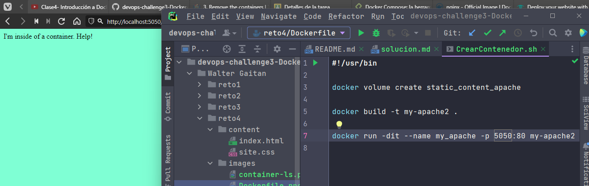

# Reto 4

1. Crear imagen de `Apache` con el contenido del archivo Dockerfile
2. Crear contenedor desde la imagen creada, este contenedor debe ser llamado ```bootcamp``` y debe copiar el contenido de la carpeta ```content```


3. Correr el script '''CrearContenedor.sh''' para crear el contenedor
4. Ingresar comando docker container ls para verificar que el contenedor se ha creado correctamente


5. Ingresar desde el navegador a http://localhost:5050 para verificar que el contenedor está funcionando

