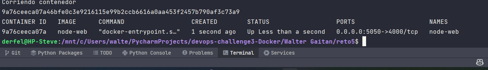
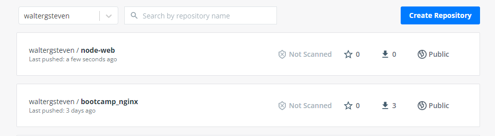

# Reto 5 

**Nota:** Para realizar todo el proceso, simplemente es necesario correr el script ```CrearContenedor.sh```

## Descripción del reto

1. Crear un Dockerfile para la imagen


2. Crear un contenedor volumenes para almacenar los archivos de la aplicación
3. Crear un contenedor para la aplicación
4. Correr contenedor de aplicación


5. Agregar un tag para la imagen
6. Subir la imagen a Docker Hub
Este ultimo paso se puede realizar con el comando ```docker push```, en mi caso lo hare de forma manual. <br>


La imagen se puede ver en la siguiente dirección: <br>
<a href="https://hub.docker.com/repository/docker/waltergsteven/node-web">waltergsteven/node-web</a>