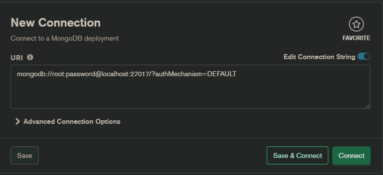
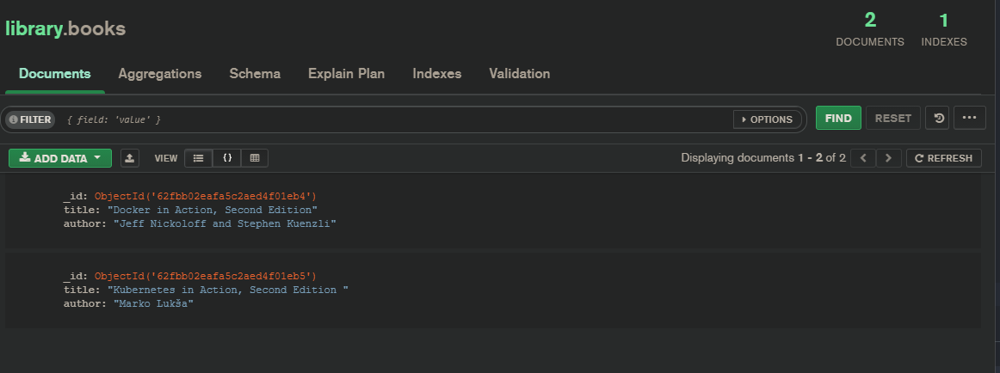
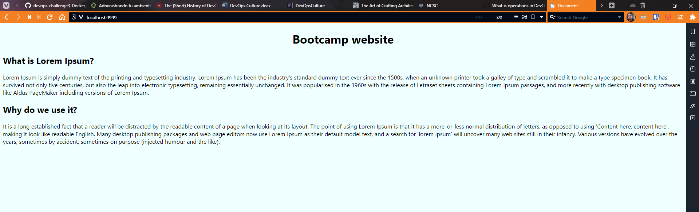
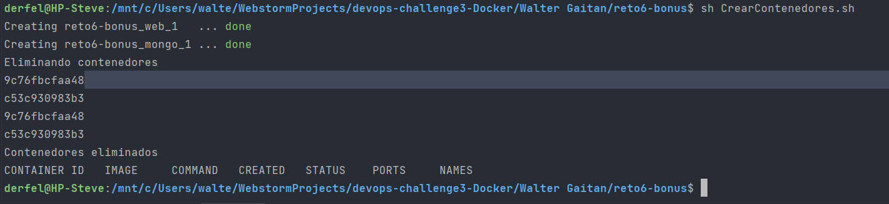

# Reto 6

1. Crear contenedor con MongoDB, protegido por usuario y contraseña.
2. Conectate utilizando Mongo Compass.

3. Crea una base de datos llamada Library con una colección llamada Books.
4. Importa los datos de books.json en el directorio de la unidad.

5. Crea un contenedor llamado bootcamp-web, con Nginx, accesible desde http://localhost:9999
6. Copia el contenido de la carpeta bootcamp-web de la unidad en la ruta que sirve este servidor.

7. Eliminar todos los contenedores que tienes ejecutándose en tu máquina despues de 60 segundos.
