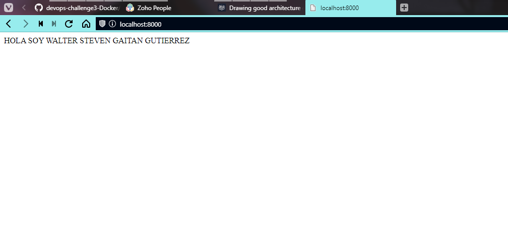
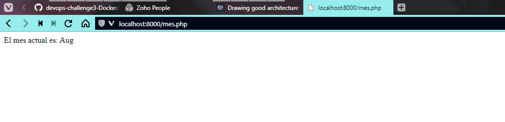

# Reto 7

1. Arrancar un contenedor que ejecute la imagen php:7.4-apache, llamado web, por el puerto 8000.
2. Colocar en el directorio raíz del contenedor un archivo index.html que contenga 'HOLA SOY XXXXX' (nombre y apellidos).
3. Ingresar al contenedor web 

4. Mostrar el mes actual en el navegador.
