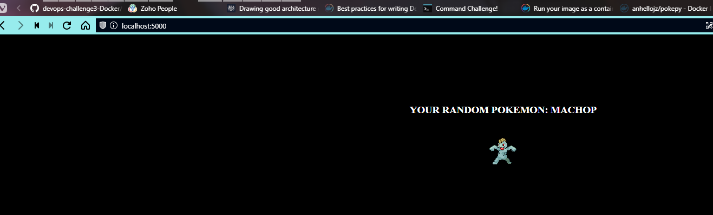

# Reto 8

1. Crear un Script en Bash que permita clonar el repositorio, crear la imagen , ejecutarla y subir la imagen, el script debe crear un mensaje en cada paso, imaginen que es un pequeño CICD pero usando Docker. 
Para esto solo es necesario correr ```Solucion.sh``` 


Una vez que se haya ejecutado el script, verificar que se haya ejecutado correctamente. 
Despues de 60 segundos el contenedor se eliminara automaticamente
2. Dentro del mismo script procedemos a subir el contenedor a docker hub.
