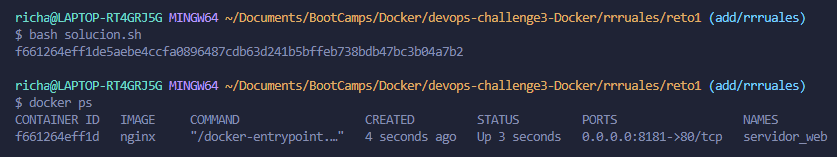
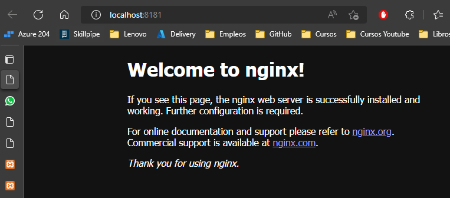
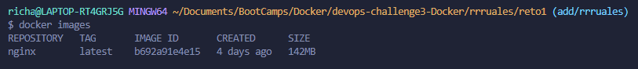
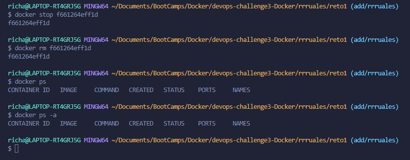

# Solución

A continuación se presenta las imágenes de la solución

### Pantallazo 1

Creacion del contenedor y en estado running.

### Pantallazo 2

Acceso a servidor web mediante navegador.

### Pantallazo 3

Imágenes en registro local.

### Pantallazo 4

Eliminación de contenedor.
