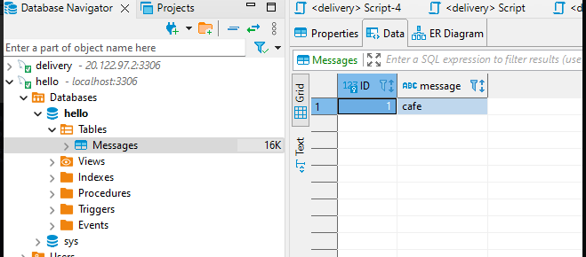
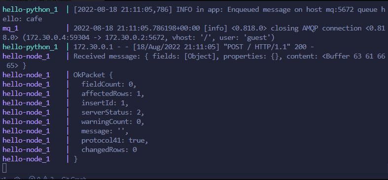

# Solución

A continuación se presenta los pasos a seguir para la solucion

### Paso 1

Dirigirse a la carpeta deployment con el comando `cd reto10-bonus/deployment/`
Ejecutar el archivo docker-compose para desplegar los contenedores con el comando `docker-compose up`

### Paso 2

Para problemas en el que se detenga la DB por cualquier error, se declara en docker-compose `restart: on-failure`, automaticamente aplica un reinicio al contenedor

### Paso 3

Para problemas de paquetes, considerar que cuando se attach un volumen a una imagen ya compilada, esta eliminara los paquetes instalados por el Dockerfile

Evidencia

