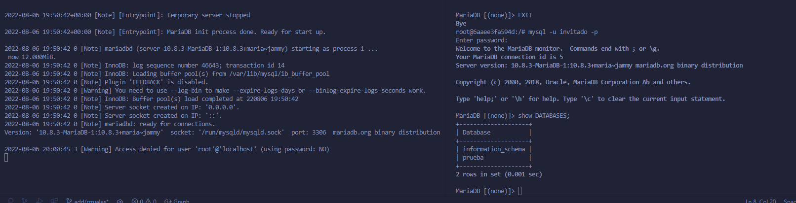
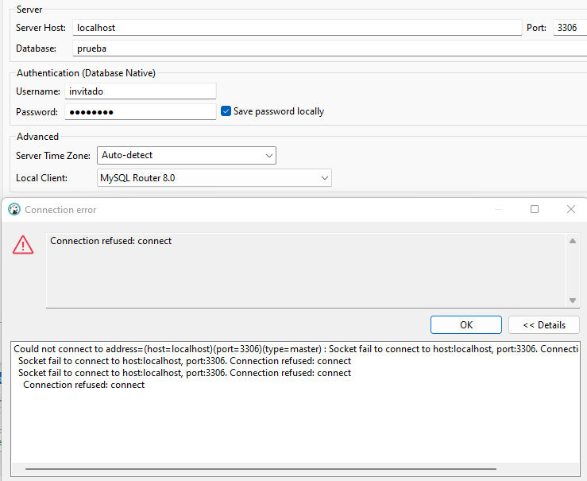
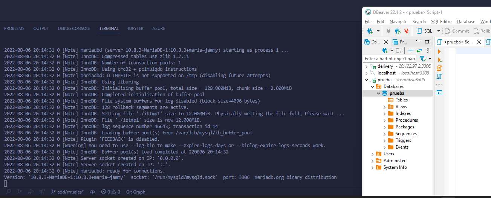
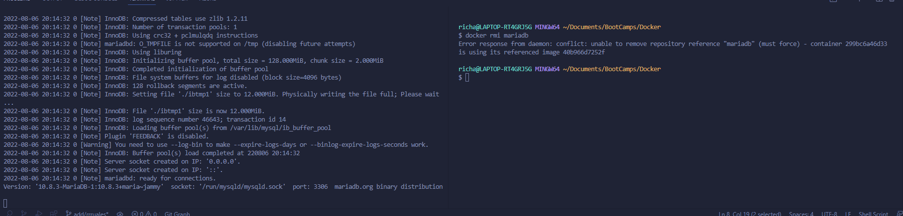

# Solución

A continuación se presenta las imágenes de la solución

### Pantallazo 1

Se crea contenedor con iamgen mariadb y estableciendo las variables de entorno.

### Pantallazo 2

Error al conectarse a la DB desde el gesto DBeaver, producido por no exponer el puerto 3206.

Se corrige error y se conecta de manera exitosa con user invitada a la DB prueba.

### Pantallazo 3

Imágenes en registro local.

### Pantallazo 4

Erro al querer eliminar imagen cuando esta siendo ejecutada por un contenedor
