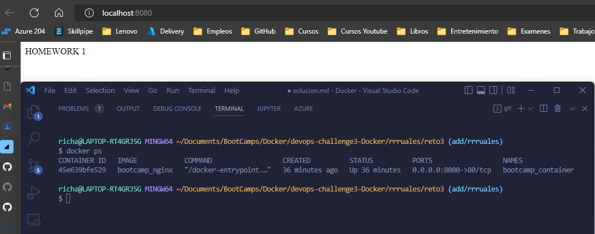
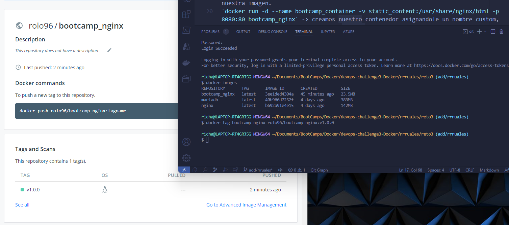

# Solución

A continuación se presenta los pasos a seguir para la solucion

### Paso 1

Crear archivo con nombre **Dockerfile** el cual nos permitira crear nuestra imagen localmente

### Paso 2

Nuestro archivo va a contener:
`FROM nginx:alpine` -> contruir nuestra imagen a partir de la imagen nginx:alpine
`COPY ./src/index.html /usr/share/nginx/html` -> Copiar nuestra app estatica a la ruta donde nginx lee los archivos

### Paso 3

Crear archivo `touch solucion.sh` para automatizar el despligue de nuestro contenedor:
`docker volume create static_content` -> creamos nuestro volumen que nos permitira persistir los datos de la app.
`docker build . -t bootcamp_nginx` -> compilamos nuestro **Dockerfile** para crear nuestra imagen.
`docker run -d --name bootcamp_container -v static_content:/usr/share/nginx/html -p 8080:80 bootcamp_nginx` -> creamos nuestro contenedor asignandole un nombre custom, exponemos el puerto 8080, asignamos nuestro volumen para q persista los datos y ejecutamos en background.

Evidencia de contenedor ejecutandose correctamente.

### Paso 4

Tagear nuestra imagen compilada para llevar un control de las versiones y poner el user de nuestro dockerhub.
`docker tag bootcamp_nginx roxsross12/bootcamp_nginx:v1.0.0`

Evidencia de carga de imagen a DockerHub.
