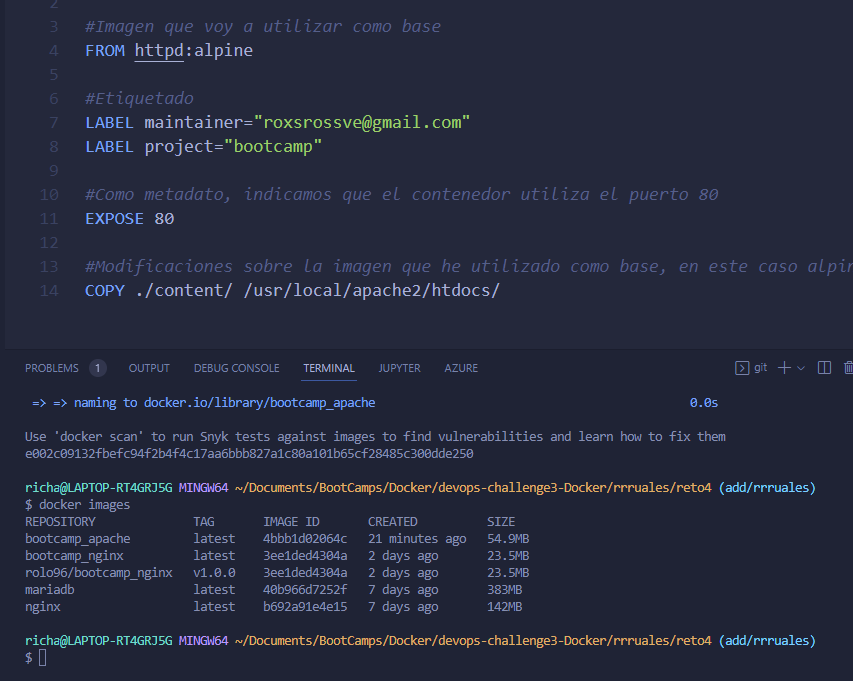
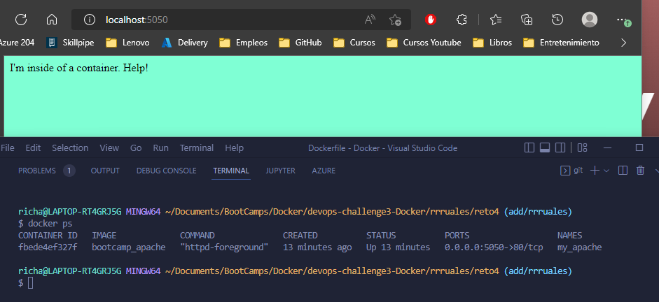

# Solución

A continuación se presenta los pasos a seguir para la solucion

### Paso 1

Crear archivo con nombre **Dockerfile** el cual nos permitira crear nuestra imagen localmente

### Paso 2

Nuestro archivo va a contener:
`FROM httpd:alpine` -> contruir nuestra imagen a partir de la imagen httpd:alpine (apache)
`COPY ./src/index.html /usr/local/apache2/htdocs/` -> Copiar nuestra app estatica a la ruta donde apache lee los archivos

Evidencia de estructura de Dockerfile.

### Paso 3

Crear archivo `touch solucion.sh` para automatizar el despligue de nuestro contenedor:
`docker volume create static_content_apache` -> creamos nuevo volumen que nos permitira persistir los datos de la app, si dejamos el volumen con el mismo nombre, nos presentara la pagina del ejercicio anterior.
`docker build . -t bootcamp_apache` -> compilamos nuestro **Dockerfile** para crear nuestra imagen.
`docker run -d --name my_apache -v static_content_apache:/usr/local/apache2/htdocs/ -p 5050:80 bootcamp_nginx` -> creamos nuestro contenedor asignandole un nombre custom, exponemos el puerto 5050, asignamos nuestro volumen para q persista los datos y ejecutamos en background.

Evidencia de contenedor ejecutandose correctamente.

### Paso 4

Respuesta a cantidad de capas de imagen.

La nueva imagen tendra 2 capas, debido a que se hace un cambio desde el principio, entonces las capas siguientes seran nuevamente compiladas, es decir, se vuelve a compilar todo la imagen, si el FROM hubiera sido nginx, entonces la nueva imagen tendria una capa, ya que la primera esta guardada en cache y usara esa para reducir el tamaño de la imagen.