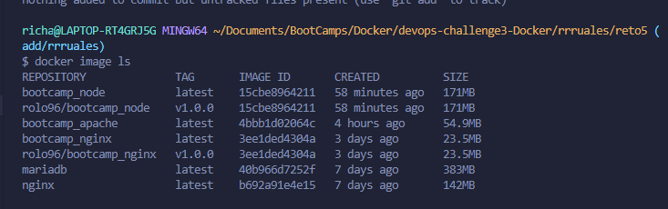
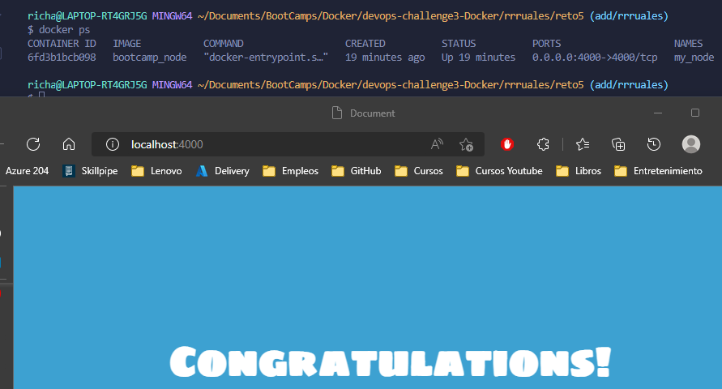

# Solución

A continuación se presenta los pasos a seguir para la solucion

### Paso 1

Crear archivo con nombre **Dockerfile** el cual nos permitira crear nuestra imagen localmente

### Paso 2

Nuestro archivo va a contener:
`FROM node:alpine` -> contruir nuestra imagen a partir de la imagen nginx:alpine

`LABEL maintainer="richard2861@hotmail.com"`
`LABEL project="node-bootcamp"` -> Etiquetar nuestra imagen

`EXPOSE 4000` -> Metadata para indicar que el puerto a usarse

`RUN mkdir /tmp/project` -> Crear directorio donde estara nuestra app

`COPY ./hello-bootcamp /tmp/project` -> Copiar nuestra app a la ruta creada anteriormente

`WORKDIR /tmp/project/hello-bootcamp` -> Indicar nuestro directorio de trabajo

`RUN npm install` -> Instalar las dependencias de nuestra app

`CMD [ "npm", "run", "start" ]` -> Ejecutar app cuando este contenerizada la imagen

Evidencia de imagen creada.

### Paso 3

Crear archivo `touch solucion.sh` para automatizar el despligue de nuestro contenedor:
`docker volume create static_content_node` -> creamos nuestro volumen que nos permitira persistir los datos de la app.
`docker build . -t bootcamp_node` -> compilamos nuestro **Dockerfile** para crear nuestra imagen.
`docker tag bootcamp_node rolo96/bootcamp_node:v1.0.0` -> Etiquetamos nuestra imagen
`docker login -u rolo96 -p 'password'` -> Iniciamos sesion en DOcker Hub
`docker push rolo96/bootcamp_node:v1.0.0` -> Pusheamos nuestra imagen a Docker Hub
`docker run -d --name my_node -v static_content_node:/tmp/project/hello-bootcamp -p 4000:4000 bootcamp_node` -> creamos nuestro contenedor asignandole un nombre custom, exponemos el puerto 8080, asignamos nuestro volumen para q persista los datos y ejecutamos en background.

Evidencia de contenedor ejecutandose correctamente.

Evidencia de imagen en Docker Regestry

