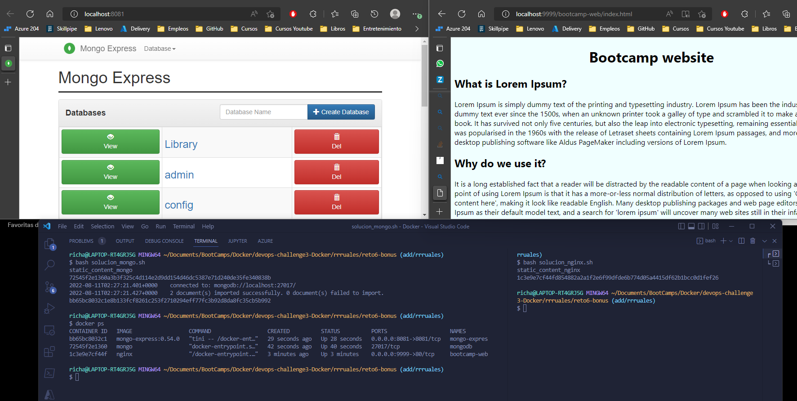

# Solución

A continuación se presenta los pasos a seguir para la solucion

Nota: No se realiza Dockerfile porque solamente se requiere copiar archivos estaticos lo cual lo podemos hacer con el comando `docker cp`.

### Paso 1

`touch solucion_mongo.sh` -> Crear script para automatizar despliegue de app

Los comandos son explciados en el script.

`bash solucion_mongo.sh` -> Ejecutar el script

### Paso 2

`touch solucion_nginx.sh` -> Crear script para automatizar despliegue de app

Los comandos son explciados en el script.

`bash solucion_nginx.sh` -> Ejecutar el script

## Evidencia de contenedores Mongo, Mongo Express y Nginx desplegados y ejecutandose

Evidencia de imagen creada.
