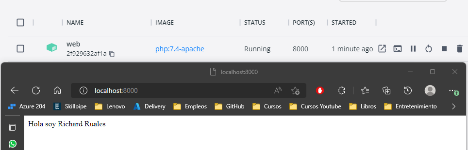
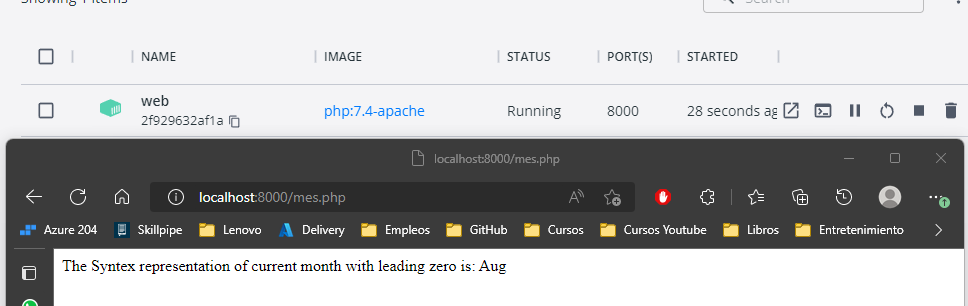

# Solución

A continuación se presenta los pasos a seguir para la solucion

### Paso 1

Se describe los pasos a seguir en el archivo .sh para automatizar el despliegue

Evidencia de despliegue de contenedor PHP.

