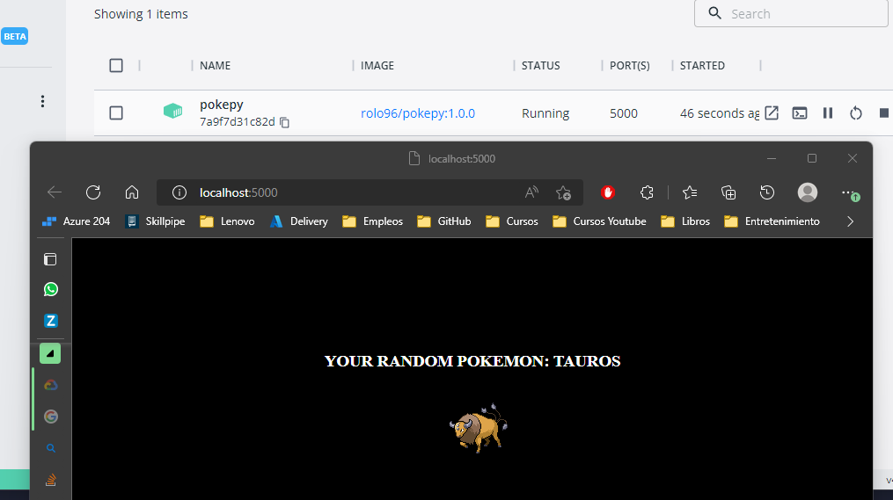
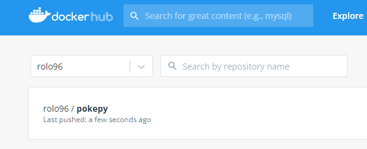

# Solución

A continuación se presenta los pasos a seguir para la solucion

### Paso 1

`bash solucion.sh` -> Ejecutar el archivo para el despliegue automatico del contenedor y push imagen a Dockerhub

*Nota:* Los pasos a realizarse estan descritos en el archivo solucion.sh

*Nota:* Realizar el cambio el requirements.txt del repositorio clonado a `flask==2.2.2`, caso contrario el contenedor no se ejecutara
Evidencia del contenedor ejecutandose

Evidencia de imagen en Docker Regestry

