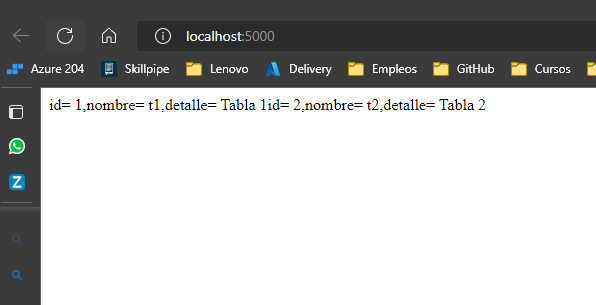

# Solución

A continuación se presenta los pasos a seguir para la solucion

### Paso 1

Crear archivo con nombre **docker-compose.yml** el cual nos permitira desplegar nuestra DB y Frontend con la ejecucion de un solo comando

Las indicaciones se encuentras en el mismo archivo.

### Paso 2

Editar el archivo `./postgres/Dockerfile` para que el contenedor de DB se ejecute correctamente.

Añadir la linea `RUN sed -i -e 's/\r$//' init-db.sh` -> Reemplazara los saltos de linea para que sea correctamente interpretado por el contenedor de DB

### Paso 3

Declaras las variables de ambiente tanto para el contenedor de DB como para el contenedor web, son importante para que puedan comincarse entre si.

Evidencia de contenedores ejecutandose correctamente

